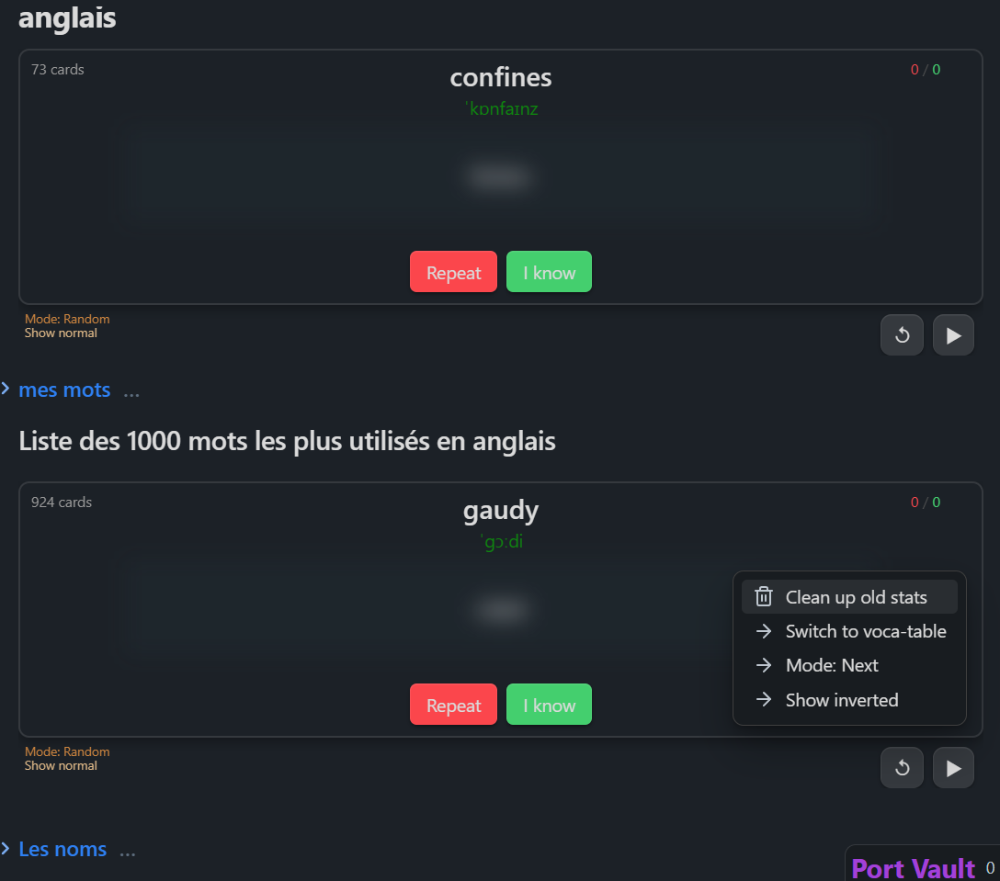

# Vocabulary cards

Source from [obsidian-vocabulary-cards](https://github.com/meniam/obsidian-vocabulary-cards)

New Version:  

Menus in 5 languages `en`, `fr`, `es`, `ru`, `zh`.

## Totally Revamped

For records, the code block languages are still `voca-card` or `voca-table`

**The new format** is `expression : [transcription] explanation` (previously transcription used <>)

**The code block is fed by the markdown page content below it.**

**Titles will be ignored**. So you can use them to organize and **fold the content under the codeblock**.

If there are multiple code blocks, the content between them will be used to fill each block.

Each codeblock now has an id, automatically generated, to save statistics. Don't copy an existing codeblock keeping the same id or delete it (id:123...).

The `↺` **button** is used to synchronize the codeblock after editing the markdown page below.

Two modes are available for card selection:
- `random`: employs a weighted random system. The number of right and wrong answers is limited to 9. Cards with 9 right answers are rarely displayed while cards with 9 wrong answers are displayed often.
- `next card`: displays cards in sequential order.
You can switch between modes using either the context menu or a dedicated button (if enabled in settings).  
  
The play `▶/⏹` button starts/stops the automatic mode. Cards are then displayed one after another, first showing the expression for a certain time and then the explanation for another time. Both times are configurable in the settings.  

**Context menu**:
- Clean data of deleted codeblocks.
- Choose mode: `random` or `next`. You can also add a button in the settings to switch between modes.
- Show inverted: invert the expression and its explanation (blured at first). Really usefull to learn in both directions.
- Switch between codeblock languages: `voca-card` or `voca-table`. To avoid to have to edit the block manually.

### Alternative access methods

- **Context menu button**: Enable the optional button (☰) in settings for visual access
- **Keyboard shortcut**: Press `Shift+F10` while the vocabulary block is focused

### Linux users

If you experience issues with right-click context menus (especially with Flatpak installations), the plugin automatically enables the context menu button by default on Linux systems. You can also use the `Shift+F10` keyboard shortcut as an alternative.  
  
  
   
[Idea to use it better to learn a language with perplexity AI](<assets/Idea to use it better to learn a language.md>)

## Development (Add this to your README)

Automate the development and publication processes on github, including releases. You are supposed to git clone your plugin out of the vault and set the right path in the .env file (1 for your trying vault, 1 for the real vault).

### Sass:
If you add a `styles.scss` file to the src folder, it will be automatically converted to CSS when running commands like npm run dev or npm run build.   
  
### Environment Setup

- **Development outside the vault:**
  - If your plugin's source code is outside the vault, the necessary files will be automatically copied to the targeted vault. Set the paths in the .env file. Use TestVault for the development vault and RealVault to simulate production.  
  
- **other steps:**   
  - You can then do `npm run version` to update the version and do the push of the changed files (package, manifest, version). Prompts will guide you.  
  
  - You can then do `npm run release` to create the release. Few seconds later you can see the created release in the GitHub releases.  

### Available Commands
  
*I recommend a `npm run start` then `npm run bacp` then `npm run version` then `npm run release`. Super fast and easy.*  
  
- **`npm run dev` and `npm start`**: For development. 
  `npm start` opens Visual Studio Code, runs `npm install`, and then `npm run dev`  
  
- **`npm run build`**: Builds the project in the folder containing the source code.  
  
- **`npm run real`**: Equivalent to a traditional installation of the plugin in your REAL vault.  
  
- **`npm run bacp`** & **`npm run acp`**: `b` stands for build, and `acp` stands for add, commit, push. You will be prompted for the commit message. 
  
- **`npm run version`**: Asks for the type of version update, modifies the relevant files, and then performs an add, commit, push.  
  
- **`npm run release`**: Asks for the release title, creates the release. This command works with the configurations in the `.github` folder. The release title can be multiline by using `\n`.